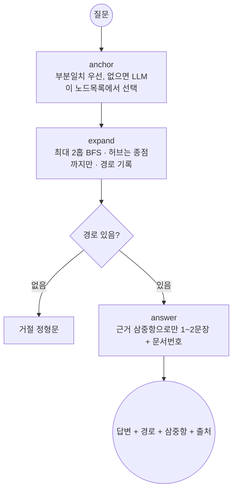

# 부동산 뉴스 GraphRAG — REPORT

도메인: 서울·경기 부동산 뉴스 (개발·거래·정책·세금) · 모델: gpt-4.1-mini · 총 API 비용 약 $0.5

## 1. 주제와 코퍼스

**왜 부동산 뉴스인가.** 수업용 영화 KB를 그대로 쓰지 않고 내 도메인으로 가져왔다.
형의 기존 작업(`news collector/my-newsletter`)에 실측済 RSS 수집기·소스 채택표가 있어
코퍼스 확보가 1회 실행으로 끝난다. `scripts/collect_corpus.py`로 96h 창에서 60건 수집,
라운드로빈으로 소스 편중 방지: 하우징헤럴드 1·한경 16·동아 15·매경 16·연합 12.
(헤럴드 1건은 주간지 특성. 소스별 적중률·탈락 사유는 my-newsletter REPORT §2 인용.)

개체 겹침(멀티홉 전제)은 수집 후 무료 점검: GTX-A/B/C노선·국가철도공단·목동 재건축·
고양창릉 등이 3~5개 문서에 걸쳐 등장함을 확인하고 추출에 들어갔다.

## 2. 골든셋과 스키마 (`data/goldenset.json` 11문항)

| 홉 | 정답 | 거절 | 문항 |
|---|---|---|---|
| 1-hop | 5 (g01~g05) | 2 (g10 부산 해운대·g11 화성 탐사) | 7 |
| 2-hop | 3 (g06 GTX기관·g07 시공사·g08 기관정책) | 1 (g09 이재명 당) | 4 |

문항마다 기대 정답 개체·기대 경로(관계 순서·방향 포함, `^`는 역방향)·원문 인용·출처
문서를 적었다. 인용·문서번호는 손으로 베끼지 않고 그래프에서 기계로 채워
(`expected_path` 22스텝 전건이 실제 엣지와 대조됨) 전사 오류를 없앴다.

스키마: 노드 5종(Region·Project·Agency·Policy·Person) + 관계 5종
(LOCATED_IN·BY_AGENCY·UNDER_POLICY·ROLE_IN·ANNOUNCED). **뽑지 않기로 한 것**:
금액·면적·일정(값 속성), 발언·인용 내용, 단순 언급. 대가: "언제·얼마" 질문 불가.
그 대신 경로가 값 없이 성립하는 구조 질문만 받는다 (`config.json`에 명시).

## 3. 측정 결과 (`output/eval.json`)

| | 1-hop (7) | 2-hop (4) | 전체 (11) |
|---|---|---|---|
| GraphRAG 정답률 | 0.86 | 1.00 | **0.91** |
| basic RAG 대조 | 0.29 | 0.50 | 0.36 |
| 경로 재현율 | 1.00 | 1.00 | 1.00 (거절 3건 제외) |

basic RAG = 질문 토큰겹침 상위 3문서 + 동일 모델 답변. 2-hop에서 격차가 가장 크다
(1.00 vs 0.50) — 건너뛰어 잇는 질문은 통째 읽기보다 그래프가 유리함을 보인다.

**실패 1건, 층 분류: g01=generation.** 경로는 탔는데(path_recall 1.0) 답의 이름이
어긋났다: 노드명은 "래미안 레비르 성수"인데 답에 "성수3지구"라 썼다. 인용문 자체에
성수3지구가 있어 사실은 맞고 문자열 지표만 실패 — 지표 한계까지 기록한다.

**개발 중 잡은 실패 3종 (수정済, 재발 방지용):**
1. 타입 샌 틈(색인): 이름만 키로 쓰니 수원[Region]이 수원[Agency]으로 새서
   "경찰청이 수원을 맡았다"는 유령 경로가 생겼다 → 노드 키를 (이름,타입)으로,
   동명이인은 연결 많은 쪽. (`agent.py`)
2. 허브 무력화(탐색): "문서 30% 이상 등장" 기준으로는 국토교통부(30연결)가 안
   걸러졌다 — 소수 문서에 몰려 있어서. 연결수 기준(`hub_min_degree: 18`)으로
   바꿨다. 실측 근거와 함께 `config.json`에 둠.
3. 거절 들쭉날쭉(생성): 모델이 "모르겠습니다(d0005)"처럼 인용을 덧붙여 지표가
   흔들렸다 → 거절은 정형문 하나로 고정. (`agent.py`)

미해결 노이즈(정직 기록): 박람회·시세 흐름이 Project로 뽑힘, BY_AGENCY 방향
불일치(양방향 탐색으로 흡수), 동일개체 표기 분기(고양창릉 B-1블록 ×2).

## 4. 파이프라인 구조도

LangGraph State(`S`): `question / anchor / paths / answer / refused`.
노드 3개(anchor→expand→answer), 분기 없음 — 거절도 answer 노드 안에서 끝낸다.

## 5. 데모 설계 (`app.py`, streamlit)

신경 쓴 것: 답과 근거의 거리. 답변 아래에 탄 경로를 전부 펼침(expander)으로 두고,
경로마다 삼중항·인용·출처 링크를 붙여 "이 답이 어디서 왔는지"를 한 화면에서
끝낸다. 예시 질문 3개(정답·거절 각 포함)를 버튼으로 둬 빈 화면 문제를 없앴다.

> 📎 화면 캡처: 미첨부 — `streamlit run app.py` 후 질문 1개+거절 1개를 캡처해 여기 붙일 것.
> (부팅은 HTTP 200 확인済.)

## 6. 회고

가장 공들인 부분: **허브 기준과 거절을 측정으로 정한 것.** "30% 문서 등장"은
이론상 맞았지만 실측에서 무력했고, 연결수 기준이 실제 폭발 지점(국토교통부 30·
서울특별시 18)을 잡았다. 거절도 "모델이 알아서"가 아니라 정형문+지표 고정까지
해야 재현됐다.

보완점: ① 별칭 병합을 정확일치+표에서 임베딩 병합으로 (고양창릉 분기 제거),
② `runs.jsonl`에 경로까지 저장 (지금은 답만 있어 경로 재현율을 별도 probe로 봤다),
③ 커뮤니티 요약(전역 검색) 미구현 — 과제 선택 항목이라 뺐고, 정책 횡단 질문에 필요해지면 붙인다.
