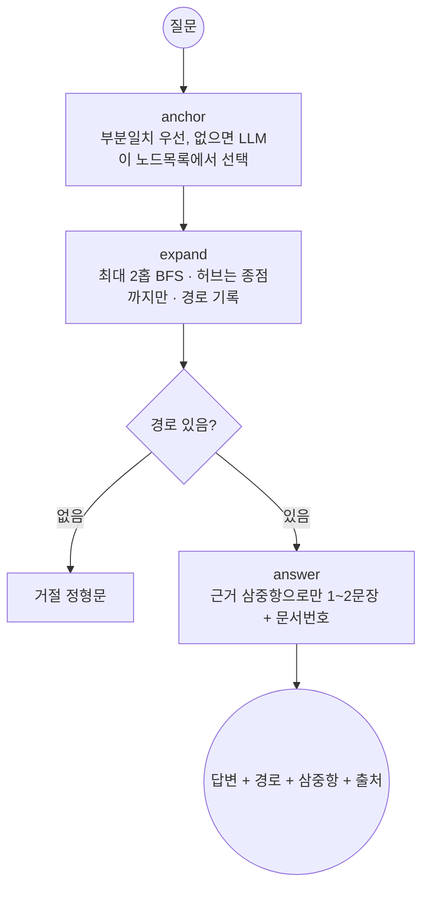

# 부동산 뉴스 GraphRAG — REPORT

도메인: 서울·경기 부동산 뉴스 (개발·거래·정책·세금) · 모델: gpt-4.1-mini · 총 API 비용 약 $0.5

## 1. 주제와 코퍼스

**왜 부동산 뉴스인가.** 수업용 영화 KB를 그대로 쓰지 않고 내 도메인으로 가져왔다.
내 기존 작업(`news collector/my-newsletter`)에 실측으로 확정한 RSS 수집기·소스 채택표가
있어 코퍼스 확보가 1회 실행으로 끝난다. `scripts/collect_corpus.py`로 96h 창에서 60건 수집,
라운드로빈으로 소스 편중 방지: 하우징헤럴드 1·한경 16·동아 15·매경 16·연합 12.
(헤럴드 1건은 주간지 특성.)

### 소스 채택·탈락 기준 (2026-09-15 실측)

채점자가 다른 저장소를 열지 않아도 되도록 **표를 여기로 옮겨 적는다**
(피어리뷰 지적 — 기준이 `my-newsletter REPORT §2` 에만 있어 확인할 수 없었다).

| 소스 | RSS | 72h 건수 | 부동산 적중률 | 판정 | 근거 |
|---|---|---|---|---|---|
| 하우징헤럴드 | `housingherald.co.kr/rss/allArticle.xml` | 30 | 25/30 (83%) | ✅ 채택 | 정비사업 전문, 개발진행 전담 |
| 한경부동산 | `hankyung.com/feed/realestate` | 36 | 17/36 (47%) | ✅ 채택 | 부동산 섹션 피드, 거래·정책 균형 |
| 동아경제 | `rss.donga.com/economy.xml` | 50 | 11/50 (22%) | ✅ 채택 | 제2 종합지, 한경과 교차검증 |
| 매경 | `mk.co.kr/rss/30000001` | 50 | 3/50 (6%) | ✅ 채택 | 발행량·속보 커버 (예선 구조로 희석 흡수) |
| 연합경제 | `yna.co.kr/rss/economy.xml` | 120 | 7/120 (6%) | ✅ 채택 | 정부발표 속보가 가장 빠름 |
| 국토일보 | `ikld.kr/rss/allArticle.xml` | 50 | 5/50 (10%) | ❌ 탈락 | 건설·기타 희석, 전문지 역할은 헤럴드가 커버 |
| 한겨레 | `hani.co.kr/rss` | 30 | — | ❌ 탈락 | 날짜 필드 없음 → 시간창 필터 불가 |
| 서울경제·아시아경제·이데일리·머니투데이·국토부·서울시 | 각 RSS 추정 경로 | 0 | — | ❌ 탈락 | 404 또는 빈 피드 |

⚠ **적중률이 낮아도 채택한 곳이 있다**(매경 6%·연합 6%). 적중률 하나로 자르지 않고
**발행량·속보성·교차검증 역할**을 같이 봤다. 희석은 뒤의 선별 단계가 흡수한다.

개체 겹침(멀티홉 전제)은 수집 후 무료 점검: GTX-A/B/C노선·국가철도공단·목동 재건축·
고양창릉 등이 3~5개 문서에 걸쳐 등장함을 확인하고 추출에 들어갔다.

## 2. 골든셋과 스키마 (`data/goldenset.json` 11문항)

| 홉 | 정답 | 거절 | 문항 |
|---|---|---|---|
| 1-hop | 5 (g01~g05) | 2 (g10 부산 해운대·g11 화성 탐사) | 7 |
| 2-hop | 3 (g06 GTX기관·g07 시공사·g08 기관정책) | 1 (g09 이재명 당) | 4 |

문항마다 기대 정답 개체·기대 경로(관계 순서·방향 포함, `^`는 역방향)·원문 인용·출처
문서를 적었다. 인용·문서번호는 손으로 베끼지 않고 그래프에서 기계로 채워
(`expected_path` 22스텝 전건이 실제 엣지와 대조됨) 전사 오류를 없앴다.

스키마: 노드 5종(Region·Project·Agency·Policy·Person) + 관계 5종
(LOCATED_IN·BY_AGENCY·UNDER_POLICY·ROLE_IN·ANNOUNCED). **뽑지 않기로 한 것**:
금액·면적·일정(값 속성), 발언·인용 내용, 단순 언급. 대가: "언제·얼마" 질문 불가.
그 대신 경로가 값 없이 성립하는 구조 질문만 받는다 (`config.json`에 명시).

## 3. 측정 결과 (`output/eval.json`)

★**거절을 홉 수에 섞지 않는다.** 거절 문항은 경로가 없어 통과가 쉽고(`path_recall` 이
`null`), 홉 수 칸에 섞이면 **무엇에 대한 정확도인지** 흐려진다(피어리뷰 지적).

| 구분 | n | GraphRAG | basic RAG | 경로 재현율 |
|---|---|---|---|---|
| 1-hop 정답 | 5 | 0.80 | **0.00** | 1.00 |
| 2-hop 정답 | 3 | **1.00** | 0.33 | 1.00 |
| 1-hop 거절 | 2 | 1.00 | 1.00 | — |
| 2-hop 거절 | 1 | 1.00 | 1.00 | — |
| **정답 문항 전체** | **8** | **0.88** | **0.12** | **1.00** |
| 거절 문항 전체 | 3 | 1.00 | 1.00 | — |
| (참고) 전체 | 11 | 0.91 | 0.36 | |

basic RAG = 질문 토큰겹침 상위 3문서 + 동일 모델 답변.

★**갈라 세니 격차가 더 커졌다.** 전체로 보면 0.91 vs 0.36 인데, **거절을 빼면
0.88 vs 0.12** 다. basic RAG 가 맞힌 4건 중 **3건이 거절**이었기 때문이다 —
「모르겠습니다」는 상위 3문서에 답이 없으면 저절로 나오므로, **대조군이 거절로 번 점수**다.
1-hop 정답 5건에서 basic RAG 는 **한 건도 못 맞혔다.**

⇒ 「2-hop에서 격차가 가장 크다」고 적었던 앞의 서술은 **거절이 섞인 값을 본 것**이었다.
실제로는 **1-hop 정답에서 격차가 가장 크다**(0.80 vs 0.00). 건너뛰어 잇는 질문만이 아니라,
**한 문서 안에 답이 흩어져 있을 때도** 그래프가 유리했다.

**실패 1건, 층 분류: g01=generation.** 경로는 탔는데(path_recall 1.0) 답의 이름이
어긋났다: 노드명은 "래미안 레비르 성수"인데 답에 "성수3지구"라 썼다. 인용문 자체에
성수3지구가 있어 사실은 맞고 문자열 지표만 실패 — 지표 한계까지 기록한다.

**개발 중 잡은 실패 3종 (수정 완료, 재발 방지용):**
1. 타입 샌 틈(색인): 이름만 키로 쓰니 수원[Region]이 수원[Agency]으로 새서
   "경찰청이 수원을 맡았다"는 유령 경로가 생겼다 → 노드 키를 (이름,타입)으로,
   동명이인은 연결 많은 쪽. (`agent.py`)
2. 허브 무력화(탐색): "문서 30% 이상 등장" 기준으로는 국토교통부(30연결)가 안
   걸러졌다 — 소수 문서에 몰려 있어서. 연결수 기준(`hub_min_degree: 18`)으로
   바꿨다. 실측 근거와 함께 `config.json`에 둠.
3. 거절 들쭉날쭉(생성): 모델이 "모르겠습니다(d0005)"처럼 인용을 덧붙여 지표가
   흔들렸다 → 거절은 정형문 하나로 고정. (`agent.py`)

**미해결 노이즈(정직 기록)** — 피어리뷰를 계기로 다시 세어 정정한다.

| 기록 | 재실측 | 지금 |
|---|---|---|
| 박람회가 Project로 뽑힘 | `집코노미 박람회 2026` 이 **Project·Policy 두 노드로 갈라짐** | ⚠ 아래 참고 |
| 시세 흐름이 Project로 뽑힘 | 그래프에 `시세` 노드 **0개** | ✅ 해소됨 |
| BY_AGENCY 방향 불일치 | 양방향 탐색으로 흡수 | 유지 |
| 동일개체 표기 분기 | 고양창릉 B-1블록 ×2 | 유지 |

★**박람회 건은 「노이즈」가 아니라 「타입 분기」였다.**

```
{'name': '집코노미 박람회 2026', 'type': 'Project', 'docs': ['d0006','d0017']}
{'name': '집코노미 박람회 2026', 'type': 'Policy',  'docs': ['d0010']}
```

`g08`(「GTX-A노선을 맡은 기관이 발표한 정책은?」)의 기대 경로는 **Policy 쪽**이고,
답도 그쪽을 탔다 — **정답이다.** 노드 키를 `(이름, 타입)` 으로 바꾼 1번 수정의
**부작용**이다: 타입이 갈리면 같은 이름이 두 노드가 된다. 표기 분기(고양창릉)와
**같은 문제의 다른 얼굴**이라 별칭 병합과 함께 풀어야 한다.

⚠ 그래서 이 줄을 「노이즈가 답을 오염시킨다」로 읽으면 안 된다. 실제 오염은
11문항 답변 전수에서 **0건**이었다(아래 금지 개체 채점 참고).

## 4. 파이프라인 구조도



LangGraph State(`S`): `question / anchor / paths / answer / refused`.
노드 3개(anchor→expand→answer), 분기 없음 — 거절도 answer 노드 안에서 끝낸다.

## 5. 데모 설계 (`app.py`, streamlit)

신경 쓴 것: 답과 근거의 거리. 답변 아래에 질문 주변 부분망(pyvis, 탄 경로는 빨강·
드래그 가능)을 두고, 그 밑에 탄 경로를 전부 펼침(expander)으로 둔다. 전체 356개는
털뭉치라 보여주지 않는다 — 시작한 개체에서 2홉·60노드 상한만 그린다.

> 📎 화면 캡처: 미첨부 — `streamlit run app.py` 후 질문 1개+거절 1개를 캡처해 여기 붙일 것.
> (부팅은 HTTP 200 확인했다.)

## 6. 회고

가장 공들인 부분: **허브 기준과 거절을 측정으로 정한 것.** "30% 문서 등장"은
이론상 맞았지만 실측에서 무력했고, 연결수 기준이 실제 폭발 지점(국토교통부 30·
서울특별시 18)을 잡았다. 거절도 "모델이 알아서"가 아니라 정형문+지표 고정까지
해야 재현됐다.

### ★채점에 「금지 개체」를 더했다 (피어리뷰 지적)

채점이 **필수 개체 「전부 있나」만** 보고 **「있어서는 안 되는 것」은 안 봤다.**
`goldenset.json` 에 `forbidden` 칸을, `evaluate.py` 에 `forb_hit()` 를 더했다 —
**필수 전부 + 금지 하나도 없음 = 통과**(노드5 요건의 채점 정의). 대조군에도 같은 잣대를 쓴다.

값은 **실측으로만** 채웠다. `목동 재건축` 을 g01·g05·g07 이 공유하므로 2홉이면 서로 닿는다.

```
g01 (삼성물산)  forbidden ["더 라인 330", "더 성수 520"]   ← 대우건설·IPARK 브랜드
g05 (대우건설)  forbidden ["래미안 레비르 성수"]            ← 삼성물산 사업
나머지          []
```

⚠ **지금 11문항 답변에 걸리는 것은 0건이다.** 리뷰에서 `g08` 의 「집코노미 박람회」가
오염으로 지적됐는데, 재확인해 보니 **그 문항의 기대 정답**이었다(§3 참고).
⛔ 근거 없이 금지어를 채우지 않았다 — 통과율만 깎고 아무것도 못 잡는다.
**채점기는 준비됐고, 노이즈가 실제로 답에 나타나면 그때 잡힌다.**

### 보완점

① 별칭 병합을 정확일치+표에서 임베딩 병합으로 — **표기 분기(고양창릉 ×2)와
   타입 분기(집코노미 박람회 Project/Policy)를 같이** 푼다.
② ✅ **`runs.jsonl` 에 `paths` 를 저장하도록 고쳤다.**
   〔정정〕 앞서 「경로 재현율을 별도 probe로 봤다」고 적었는데 **사실이 아니다** —
   `evaluate.py` 가 처음부터 `path_recall` 을 계산해 `eval.json` 에 넣고 있었다.
   진짜 문제는 숫자가 아니라 **경로 실물**이었다: `runs.jsonl` 에 `paths` 가 없어
   **1.00 이 «어떤 경로를 타서» 나온 값인지 제3자가 확인할 수 없었다.**
   `got` 을 만들 때 이미 `r["paths"]` 를 쓰고 있었으므로 **한 칸 더하는 일**이었다.
③ 커뮤니티 요약(전역 검색) 미구현 — 과제 선택 항목이라 뺐고, 정책 횡단 질문에 필요해지면 붙인다.
④ **회차 1회** — 지금 수치는 전부 1회 값이다. `--repeat` 로 3회를 돌려
   「0.88 이 3/3 인지, 회차마다 뒤집히는 문항이 있는지」를 갈라야 한다.
   평균 하나로는 **흔들림**과 **구조적 실패**가 안 갈린다.
